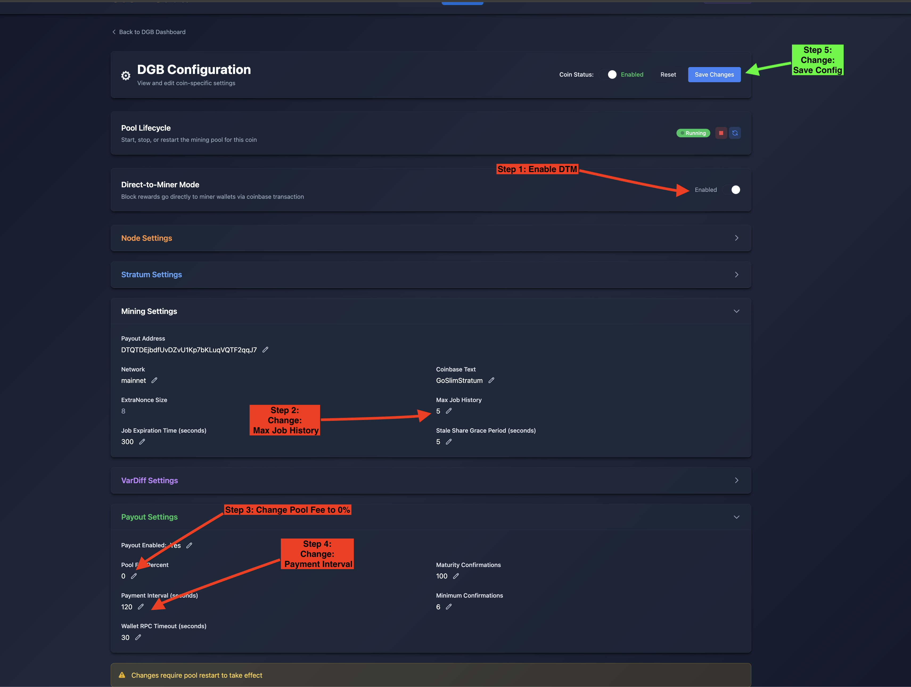
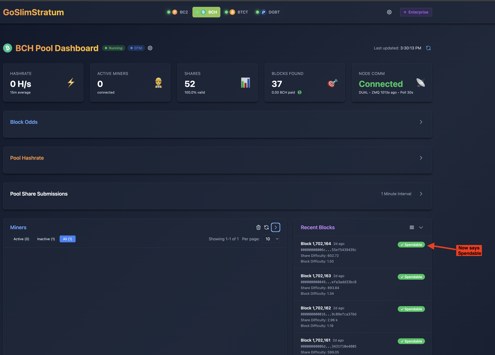
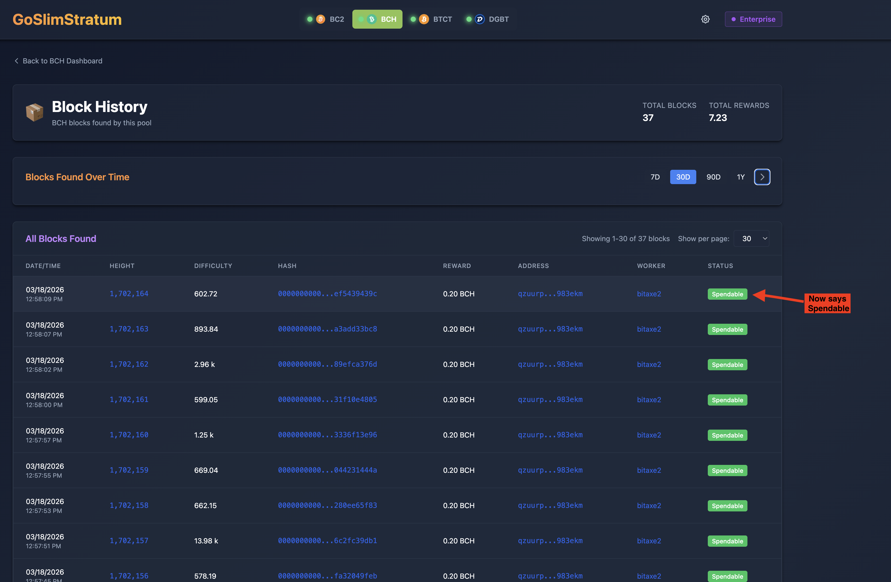
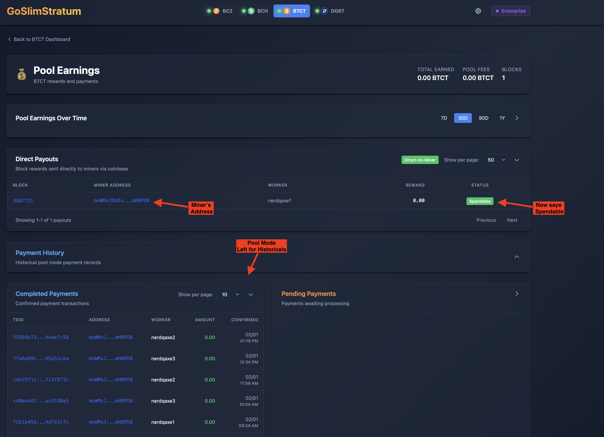
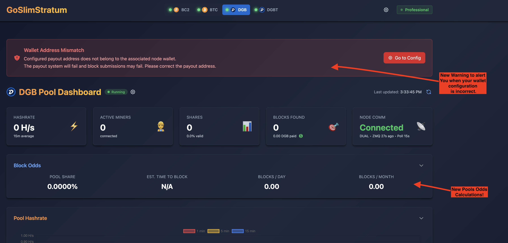

# Direct-to-Miner (DTM) Mode — Best Practices Guide

## What is DTM Mode?

Block rewards go directly to the miner's wallet via the coinbase transaction. No payout system needed — miners get paid the moment a block is found (spendable after maturity confirmations). This is fundamentally different from pool mode where the pool collects rewards and distributes payments.

---

## For Solo Miners (Personal Instance)

You're running GoSlimStratum for yourself and your own mining devices (Bitaxe, NerdQAxe, etc.).

### Enabling DTM

1. Navigate to your coin's **Configuration** page
2. In the **DTM** card:
   - **With a license**: Toggle DTM on — done
   - **Without a license**: Toggle DTM on → Accept the 0.5% revenue share agreement in the modal prompt
3. Save and reload the coin pool

### Recommended Configuration

| Setting | Value | Why |
|---------|-------|-----|
| `pool_fee_percent` | **0%** | You're mining to yourself — no fee needed. Single coinbase output to your wallet. |
| `max_job_history` | **5** | DTM generates per-miner jobs. Lower history saves memory. Default 20 is overkill for solo. |
| `payout.enabled` | **true** | Enables maturity tracking so your dashboard shows Immature → Spendable status. |
| `payout.check_interval_seconds` | **120** | Faster maturity status updates on the dashboard. No actual payouts to process in DTM. |
| `mining.address` | **leave as is (default)** | With 0% fee, this address isn't used in the coinbase — but keep it valid for config validation. |

### What You'll See

- **Dashboard**: Block found → "Immature" badge with confirmation countdown → "Spendable" green badge
- **Earnings page**: "Direct Payouts" table showing your blocks with status
- **Your wallet** (Exodus, etc.): Transaction appears immediately as unconfirmed, spendable after maturity

### Key Differences from Pool Mode

- No pending payments — rewards are in the coinbase, not a separate transaction
- No transaction fees for payouts — the block reward IS the payment
- No minimum balance to accumulate — every block goes directly to you
- The pool fee address (`mining.address`) is only used if `pool_fee_percent` > 0

---

## Screenshots

### Coin Configuration — DTM Setup

Enable DTM, lower max job history to 5, set pool fee to 0% (solo) or your desired fee (operator), and lower the payment interval to 120 seconds for faster maturity status updates.

### Coin Pool Dashboard — Spendable Blocks

Recent Blocks on the dashboard show "Spendable" green badges once blocks have matured. Blocks in progress show "Immature" with a confirmation countdown.

### Blocks Page — Full History

The Blocks page shows all blocks found with their status. DTM blocks that have matured display the green "Spendable" badge.

### Earnings Page — Direct Payouts

The Earnings page shows a "Direct Payouts" table with miner addresses, workers, rewards, and status. The "Direct-to-Miner" badge confirms DTM mode is active. Pool mode payment history is preserved below for historical records.

### Wallet Address Mismatch Warning

In pool mode, if the configured payout address does not belong to the node wallet, a red warning banner appears with a link to fix the configuration. This warning is suppressed in DTM mode where external addresses are expected. Also shown: the new Block Odds card with pool share and estimated time to block.

