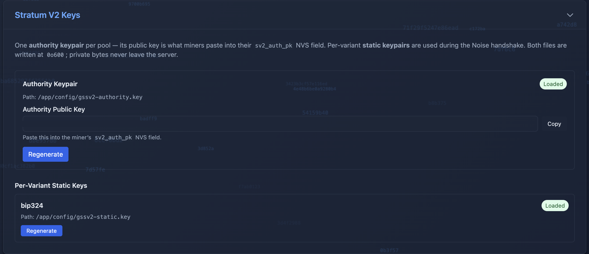
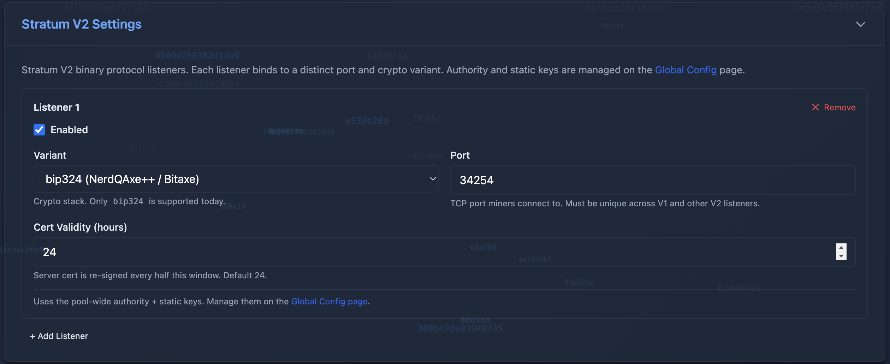

# Stratum V2 Setup Guide — v5.0.0

This guide walks you through enabling Stratum V2 (SV2) on your GoSlimStratum pool. It's broken into three phases:

1. **Generate the pool's keys** on the Global Configuration page (once, pool-wide).
2. **Enable the V2 listener** on each coin you want to serve over V2.
3. **Point your V2-capable miner** at the new V2 port using the authority public key from step 1.

The whole flow takes about five minutes once you're done reading this.

---

## What Is Stratum V2?

Stratum V2 is the next-generation mining protocol — an encrypted, authenticated, binary upgrade to the classic Stratum V1 protocol from 2012.

Three things matter for a pool operator:

- **The traffic is encrypted.** Every byte between miner and pool is wrapped in a Noise-protocol handshake (the same crypto family used by WireGuard and the Lightning Network). Nobody on the network path between the miner and the pool can read, log, or modify shares.
- **The pool is authenticated.** Each miner verifies it is talking to *your* specific pool by checking the server's certificate against an authority public key that you paste into the miner's NVS during setup. Share-hijack man-in-the-middle attacks become impossible.
- **The protocol is binary.** Smaller frames, less CPU on both ends. On ESP-based ASIC miners (Bitaxe, NerdQAxe), that means slightly more cycles available for actual hashing.

GSS v5.0.0 supports **both V1 and V2 simultaneously**. V1 miners keep working with no changes. V2-capable miners (like the NerdQAxe++ shipping today) can connect to a new V2 port that you enable per-coin.

---

## Before You Begin

**You need:**

- GoSlimStratum v5.0.0 or later, running and reachable in your browser.
- At least one coin already configured and mining successfully over V1 (so you know the rest of your setup is healthy before adding a new variable).
- A SHA256d coin — that's BTC, BCH, DGB (SHA256d algorithm), or XEC. Scrypt coins (LTC, DOGE) are not supported by Stratum V2 in this release.
- A V2-capable miner to test with. Today that's any NerdQAxe++ on shipping firmware; soon it will include Bitaxe devices running the [SV2 firmware PR #1553](https://github.com/bitaxeorg/ESP-Miner/pull/1553).

**You'll create two key files on the GSS host:**

- `gssv2-authority.key` — the pool's authority key. Its public half is what miners paste into their NVS.
- `gssv2-static-bip324.key` — the per-variant static key. Used internally during the encrypted handshake. Never published, never pasted.

By default both files are written to `/app/config/` (alongside `config.json`) inside the GSS container. If you've mapped that volume to `./config/` on your host (the standard `docker-compose.yml` does), the files will appear there.

---

## Phase 1 — Generate the Pool Keys

Navigate to the **Global Configuration** page in the GSS Web UI. At the bottom of that page is a **Stratum V2 Keys** card:



The card has two sections:

### Authority Keypair

This is the most important key in the entire SV2 setup. Its public half (a Base58-encoded string starting with letters and numbers, typically 50 characters long) is what you'll paste into every miner's `sv2_auth_pk` NVS field. It identifies your pool to your miners.

1. Click **Generate** (if the key doesn't exist yet) or **Regenerate** (if you want to rotate it).
   - **First time generation** runs immediately and writes the file.
   - **Regeneration is destructive** — every miner you've already configured with the OLD pubkey will refuse to handshake against the new one until you update each miner's NVS. The Web UI requires you to type `GENERATE` to confirm.
2. The **Authority Public Key** field populates with the Base58 string. Click **Copy** to put it on your clipboard. You'll need it in Phase 3.

### Per-Variant Static Keys

These keys are used internally by the Noise handshake and **never need to be copied or pasted anywhere**. They identify the server side of each crypto variant; today that's just `bip324`.

1. Click **Generate** on the `bip324` card if it shows "Not present."
2. Status badge flips to **Loaded**.

You can regenerate static keys whenever you like — it's a low-impact operation. Miners don't store these and don't need to be updated. The cert refresh goroutine inside GSS handles the new key on the next restart.

> **Tip:** Both key files are written with Unix mode `0600` (owner-read-only). The private bytes never leave the server.

---

## Phase 2 — Enable the V2 Listener on a Coin

Navigate to the **Coin Configuration** page for the coin you want to serve over V2 (e.g. DGB, BTC). Scroll down to the **Stratum V2 Settings** section:



### Add a Listener

If no listener exists yet, click **+ Add Listener**. A new entry appears with sensible defaults:

| Field | Default | What It Means |
|-------|---------|---------------|
| **Enabled** | unchecked | Toggle on to actually bind the V2 port. Leave unchecked to keep the config in place without starting the listener (useful for staging). |
| **Variant** | `bip324` | The SV2 crypto variant. Only `bip324` is supported today. Future variants (like SRI) will appear in this dropdown as they're added. |
| **Port** | `34254` | The TCP port your V2 miners will connect to. Must be unique across V1 stratum ports and any other V2 listeners — GSS will reject the save if a port is reused. |
| **Cert Validity (hours)** | `24` | How long each issued server certificate is valid. GSS auto-renews on the half-window (default every 12 hours) so newly-connecting miners always see a fresh cert. Already-connected miners are unaffected. |

### Save and Restart

1. Check the **Enabled** checkbox.
2. Confirm the port is free (default `34254` is the convention; pick anything different if your network has that port used elsewhere).
3. Click **Save** at the bottom of the page.
4. **Restart GSS** — the V2 listener only binds on startup. Stop and start your Docker container (or restart the process if running natively).

When GSS comes back up, you should see a log line like:

```
[stratum_v2] SV2 server (variant=bip324) listening on 0.0.0.0:34254
```

If the port shows up in the header coin-chip tooltip when you hover the coin name in the top-right of any page, you've successfully bound the V2 listener.

### Coin Algorithm Restriction

If the coin you're configuring isn't a SHA256d coin (i.e. it's Scrypt, Skein, or Qubit), you'll see a polite "Stratum V2 is not available for this coin" message instead of the listener editor. This is by design — SV2's job-broadcast and share-decode pathways are SHA256d-specific in this release.

---

## Phase 3 — Point Your Miner at the V2 Port

The miner-side configuration depends on your firmware, but the high-level steps are the same:

1. Open your miner's web UI or NVS configuration interface.
2. Find the **Stratum** or **Pool** settings.
3. Change the protocol selector to **Stratum V2** (or **SV2**). On NerdQAxe++ this is typically a toggle or radio button on the Mining tab.
4. Update the **stratum URL** to point at your GSS host on the V2 port, e.g. `192.168.1.50:34254`. (For SV2 you don't need the `stratum+tcp://` prefix in most firmware.)
5. Paste your **Authority Public Key** (from Phase 1) into the `sv2_auth_pk` field.
6. Keep your worker name / wallet address the same as you used for V1 — it's the same string. GSS tracks the worker by name regardless of protocol.
7. Save settings on the miner; it should connect within 5–30 seconds depending on firmware.

In the GSS Web UI, navigate to the coin's dashboard — you should see your worker appear in the miners table with a **`v2`** pill next to its name (a small rounded badge to the left of the worker name, replacing the green/red status dot that previous releases used).

If the miner doesn't connect:

- **Check the GSS logs** for messages tagged `[stratum_v2]`. A failed handshake will usually log the reason (wrong authority key, miner sending V1 protocol on V2 port, etc.).
- **Verify the authority public key was pasted correctly.** Trailing whitespace or a missing character is a common failure mode.
- **Confirm the firewall** allows incoming connections on the V2 port. Default `34254` is unusual enough that it likely isn't open out of the box.

---

## What If I Want Multiple V2 Variants Later?

The per-coin `sv2` field in `config.json` is an array, not a single object. When future variants ship (like SRI), you'll add a second entry on a different port:

```json
"sv2": [
    { "variant": "bip324", "enabled": true, "port": 34254, "cert_valid_hours": 24 },
    { "variant": "sri",    "enabled": true, "port": 34255, "cert_valid_hours": 24 }
]
```

Each variant uses its own static key from the global `sv2.variants.*.static_key_path` paths but shares the single pool-wide authority key. Miners only need to know **one** authority public key regardless of which variant they connect with.

The Web UI's per-coin **Stratum V2 Settings** section's `+ Add Listener` button supports this directly — just add another listener with a different variant.

---

## When To Regenerate Keys

| Situation | Recommended Action |
|-----------|-------------------|
| First install of v5.0.0 | Generate the authority key + bip324 static key on the Global Config page. |
| Authority key compromised (server breach, accidental commit to git) | **Regenerate** the authority key. Paste the new pubkey into every miner's NVS. |
| Routine rotation policy | Static keys can be rotated freely with no miner impact. Authority key rotation is high-impact — only do this on a planned maintenance window when you can update every miner. |
| Migrating GSS to a new server | **Copy the key files to the new server** at the same paths. Don't regenerate — you'd have to update every miner's NVS again. |

The key files are just raw 32-byte private keys on disk. Back them up like you back up your wallet — the loss of the authority key file means every miner becomes unable to connect until they're re-configured with a fresh pubkey.

---

## Frequently Asked Questions

**Q: Do I have to enable V2 to upgrade to v5.0.0?**
A: No. v5.0.0 ships with V2 disabled on every coin by default. Upgrading from v4.1.2 is a zero-risk drop-in — your V1 miners keep working unchanged on the same ports. V2 is opt-in per coin.

**Q: Can V1 and V2 miners mine the same coin pool at the same time?**
A: Yes — that's the design. Both protocols feed into the same job-management and share-validation pipeline. The dashboard shows a `v1`/`v2` pill next to each worker so you know which protocol each device is using.

**Q: My V1 miner isn't working after I enabled V2 — what happened?**
A: Nothing changed for V1. V1 listens on the same port it always did (typically `3333`), and V2 listens on a brand new port (typically `34254`). Make sure your V1 miner is still pointed at the V1 port, not the V2 port. V1 miners cannot speak V2 — they'll fail the handshake silently.

**Q: I rotated the authority key and now no miners can connect.**
A: Expected — rotating the authority key invalidates every miner's stored pubkey. Update each miner's NVS with the new Base58 public key (visible on the Global Config page after generation) and they'll reconnect.

**Q: Does V2 require a license?**
A: No. SV2 is a core feature of v5.0.0 and is available to all users at all license tiers. The free tier's standard limits (one coin type, four miners max) still apply, but they apply to V1 + V2 combined miner counts — V2 connections aren't "free extras."

**Q: Does V2 work with DTM mode and revenue share?**
A: Yes — fully. The share-handling pipeline is the same code path for V1 and V2, so DTM coinbases, revenue share splits, and license enforcement all work identically regardless of protocol.

**Q: What firmware supports V2 today?**
A: **NerdQAxe++** firmware shipping today supports BIP-324 SV2. **Bitaxe** support is pending the merge of [ESP-Miner PR #1553](https://github.com/bitaxeorg/ESP-Miner/pull/1553). Other ASIC firmware (Antminer / Avalon / etc.) generally does not yet support SV2 — keep those on the V1 port.

**Q: Where do I find help / report issues?**
A: GSS issues and feature requests are tracked at the project's main repository. Include relevant log lines tagged `[stratum_v2]` (and `[stratum]` for V1 cross-checks) when reporting protocol-level issues.

---

## Next Steps

- ✅ Keys generated on the Global Config page.
- ✅ V2 listener enabled on at least one coin.
- ✅ One miner pointed at the V2 port.
- 📈 Watch the coin dashboard for the `v2` pill on your test miner.
- 🎯 Confirm shares are arriving — accepted count should climb just like a V1 miner.

For the configuration-field reference:
- [GoSlimStratum Coin Configuration Guide — Stratum V2 Section](../../documents/GoSlimStratum/gss-coin-config-guide.md#stratum-v2-section---as-of-version-500)
- [GoSlimStratum Global Configuration Guide — Stratum V2 Keys](../../documents/GoSlimStratum/gss-global-config-guide.md#stratum-v2-keys---as-of-version-500)
